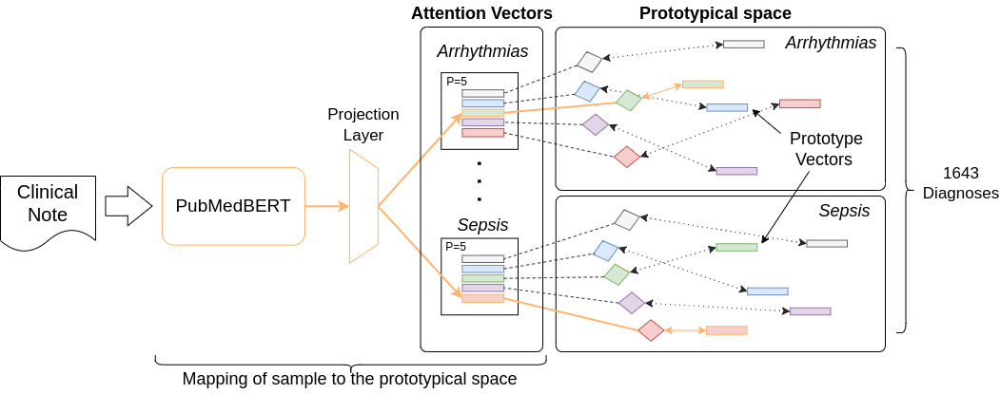

# Boosting Long-Tail Data Classification with Sparse Prototypical Networks 

This repository includes source code to replicate experiments and train S-Proto.

## Usage

Set up the environment with poetry
Shell into the environment and execute in a shell:
```
 train \
--batch_size 3 \
--pretrained_model microsoft/biomednlp-pubmedbert-base-uncased-abstract-fulltext \
--pretrained_model_path path_to_pretrained_model.ckpt \
--model_type MULTI_PROTO \
--train_file training_data.csv \
--val_file  validation_data.csv \
--test_file test_data.csv \
--save_dir ../experiments/ \
--gpus 1 \
--check_val_every_n_epoch 2 \
--num_warmup_steps 0 \
--num_training_steps 50 \
--max_length 512 \
--lr_features 0.000005 \
--lr_prototypes 0.001 \
--lr_others 0.001 \
--num_val_samples None \
--use_attention True \
--reduce_hidden_size 256 \
--all_labels_path all_labels.pcl \
--seed 42 \
--label_column labels \
--metric_opt auroc_macro \
--train_files [] \
--val_files [] \
--only_test True \
--model_name 5p \
--store_metadata False \
--num_prototypes_per_class 5 \
```
